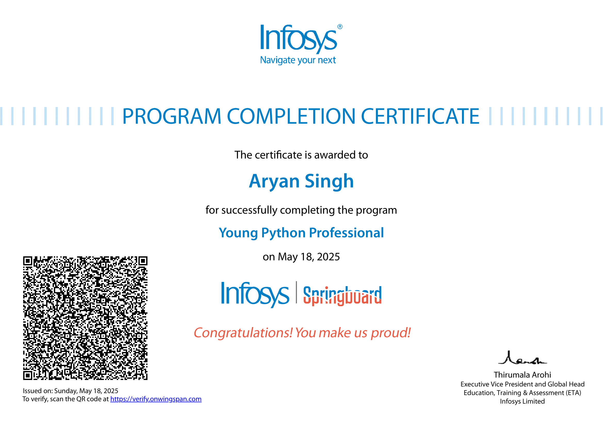

# My Python Journey: From Syntax to Substance

Python has long stood at the intersection of simplicity and power. For many, it is a first language; for others, it is a lifelong companion in the pursuit of clean, scalable software. For me, it has become both. What began as an exploration of syntax has matured into a deeper engagement with algorithms, data, software design, and digital thinking.

## Foundations of Logic and Structure

My first steps with Python were guided by a strong emphasis on logic and structure — the fundamentals of programming. I became fluent in core constructs: loops, conditionals, functions, lists, dictionaries, and string operations. These were not merely tools to complete assignments, but the foundational blocks for solving problems in the real world.

From writing scripts that sort data to designing reusable functions that could perform mathematical or text-based computations, I began to understand how simplicity could be powerful. Over time, the line between academic exercises and practical applications started to blur.

## Data Structures: Thinking Beyond the Line

Arrays and lists introduced me to linear thinking. But stacks, queues, and dictionaries — and more complex operations like searching and sorting — helped me understand algorithmic depth. Implementing linear and binary searches, bubble and insertion sorts, and recursive logic pushed me to think about space-time complexity and design trade-offs.

These data structures were no longer abstract textbook concepts. They became mental models for organizing thought, whether managing user interactions or optimizing backend processes.

## Exploring Databases: MySQL and the Language of Data

Parallel to mastering Python, I explored the world of relational databases, primarily through MySQL. I learned to structure and query data — understanding the principles of normalization, constraints, and indexing.

Integrating MySQL with Python using connectors allowed me to create data-driven applications, where information could be stored, retrieved, and updated dynamically. Writing CRUD (Create, Read, Update, Delete) operations and building dashboards felt like a natural progression of my learning, expanding my scope from standalone scripts to interactive, persistent systems.

## Working with Files and Real Data

Python’s file handling capabilities introduced me to the world of persistent storage and real-world data processing. Reading and writing to `.txt` and `.csv` files taught me how to work with structured and semi-structured datasets. These skills became especially powerful when combined with Python’s libraries — allowing me to parse data, filter meaningful information, and even visualize insights.

I also explored binary files and how structured data could be serialized and deserialized using Python's built-in methods. This understanding of data storage deepened my knowledge of how applications maintain state and interact with external sources.

## Graphical Interfaces and User Experience: `customtkinter`

A turning point in my journey was discovering `customtkinter`, a modern extension of Python’s native GUI toolkit. With it, I created aesthetically pleasing, responsive interfaces that felt professional and intuitive.

Beyond writing backend logic, I began to think like a product designer: How does a user experience flow? What visual hierarchy guides user attention? How can animations or layout grids enhance usability? These questions fueled my understanding of how code translates into experience.

## APIs: Python as a Tool of Interconnectivity

APIs allowed me to see software not just as isolated programs, but as interoperable components of a larger digital ecosystem. I worked with REST APIs to fetch external data, submit user-generated information, and build dynamic features like live search, form submissions, or even small-scale automation bots.

By learning to handle JSON, headers, tokens, and asynchronous flows, I developed a respect for web architecture and its infinite possibilities when paired with Python.

## Professional Validation: Infosys Python Certification

To formalize my skills, I earned a certification from Infosys in Python programming. This certification not only validated my proficiency but also exposed me to industry-relevant use cases, best practices, and problem-solving approaches.

## A Case Study: The Numerology Web App

My most significant application of all these skills is the [Numerology App](https://github.com/aryan6673/numerology-app). This project is a synthesis of everything I’ve learned so far — from clean UI built with `customtkinter`, to backend logic written in modular Python, and future-ready integrations with APIs and file storage systems.

The app calculates and interprets numerological values using various algorithms, presenting results in an accessible, visual way. More than just a technical feat, it taught me the importance of code readability, user experience, and project management. I maintained a clear directory structure, separated business logic from presentation, and documented the code for scalability.

## Final Thoughts: Where the Road Leads Next

Python has taught me more than how to code. It has taught me how to think systematically, design intentionally, and build ethically. Moving forward, I aim to explore Python’s use in machine learning, web development frameworks like Django or Flask, and deeper contributions to open-source ecosystems.

More than a tool, Python is a language of ideas — and I’m only getting started.

---

**Author**: Aryan Singh  
**GitHub**: [@aryan6673](https://github.com/aryan6673)  
**Featured Project**: [Numerology App](https://github.com/aryan6673/numerology-app)
